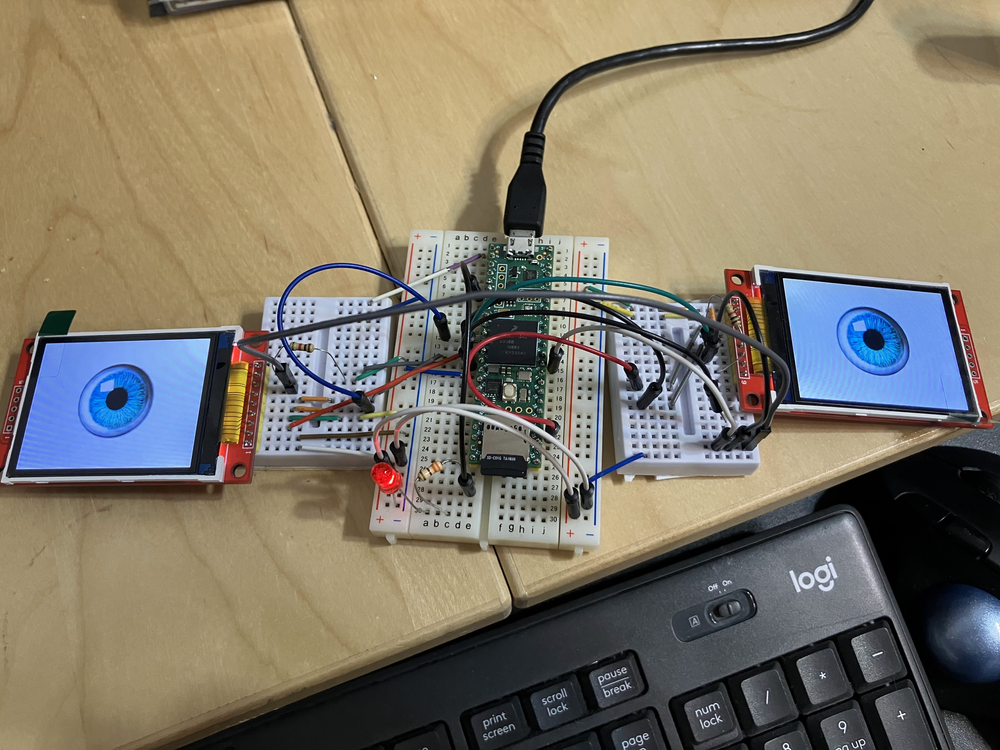
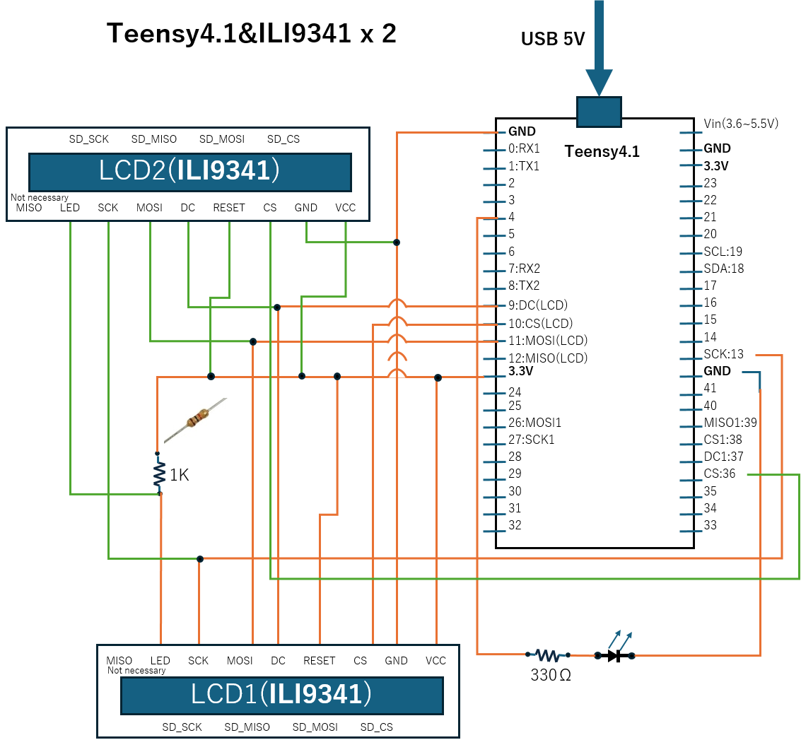

# Teensy41_ILI9341_t3nx2_SD
This is a sample code to run two LCD displays ILI9341 on Teensy4.1 with SD card.

# Circuit diagram

# Reference
This code use the library of kurte/ILI9341_t3n.

[kurte/ILI9341_t3n] https://github.com/KurtE/ILI9341_t3n
